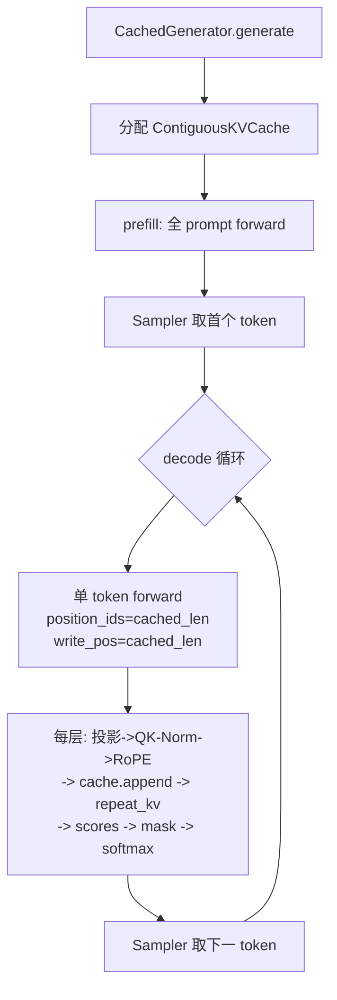

## 产品概述

LiteInfer 是自主实现的单卡高吞吐 LLM 推理引擎。本阶段（Task 04）在 Task 03 自建的 Qwen2 前向图上引入 **Contiguous KV Cache**，把「每步全序列重算」升级为「prefill 一次 + decode 逐步复用历史 K/V」，并给出可复现的延迟对照。

## 核心功能

- **缓存本体**：按层预分配的连续 K/V 缓冲区，支持按偏移写入新 token、零拷贝读取完整历史、容量越界显式报错、字节占用可核算。
- **prefill / decode 两阶段**：prefill 一次性处理整个 prompt 并落盘 K/V；decode 每步只算 1 个 token，按绝对位置续接 RoPE。
- **past KV 复用**：模型不再返回 `past_key_values`，而是把新算出的 K/V 直接写进外部持有的缓存，再用缓存视图做注意力，避免每步全量拼接拷贝。
- **生成链**：带缓存的生成器，输出与不带缓存版本逐 token 一致，并拆出 prefill / decode 两段耗时。
- **延迟 benchmark**：同一模型下 no-cache 与 KV-cache 对照，支持设备、生成长度、重复次数、结果导出，并强制校验两者输出一致。
- **工程纪律**：全程 CPU + FP32 可跑，设备与 dtype 只来自配置，无 GPU 时指标显示不可用而非 0。

## 技术栈

- 语言/框架：Python 3.13 + PyTorch（CPU 版），沿用现有 `liteinfer` 包结构与 `EngineConfig` 集中配置
- 测试：pytest（`addopts = "-m 'not model'"`；真实模型用 `pytest -m model`，容差复用 `liteinfer.model.alignment`）
- 质量：类型标注 + docstring（解释「为什么」）、ruff 友好；benchmark/生产路径分离
- 设备纪律：设备与 dtype 一律来自 `EngineConfig.device / EngineConfig.dtype`；`torch.cuda.*` 只在 `liteinfer/device.py` 内出现且带 CPU 兜底

## 实现思路

核心策略：**KV 缓存由外部（generator，未来的 engine）持有，模型只负责「把新算出的 K/V 原地写入缓存 + 用缓存视图算注意力」**。相比「模型返回 past_key_values、调用方再 cat 回显存」的常见写法，本方案每步只写入 `n` 个新 token（decode 时为 1），不复制历史，decode 的内存流量从「读 T + 写 T」降为「读 T + 写 1」。

关键决策与取舍：

1. **向后兼容的函数签名**（`kv_cache=None, write_pos=0` 默认参数）：Task 03 的 16 条算子单测与 7 条对齐测试直接调用 `layer(h, pos, mask)`、`minimal(input_ids)`，默认路径行为必须逐位不变。**不改动任何既有测试**是硬约束。
2. **模型始终返回 logits 张量**，不返回 `past_key_values`：避免 `Tensor | tuple` 的联合返回类型污染 Task 03 的 `torch.testing.assert_close(mine, hf)` 断言。
3. **缓存写入放在 RoPE 之后**：缓存里存的是「旋转后的 K」，与推理期语义一致；若存旋转前，decode 时无法直接复用。
4. **`build_causal_mask(..., past_len=0)` 扩展而非新增函数**：用 `k_pos <= q_pos` 的 `masked_fill_` 统一实现，`past_len=0` 时与原 `triu` 实现逐值等价（既有因果结构单测仍绿）；decode（`seq_len == 1`）时单个 query 恒可见全部历史，直接传 `None` 省一次加法。
5. **消融基线用同一个 MinimalQwen**：`CachedGenerator(use_cache=False)` 而非拿 HF 模型比，排除「HF vs 自建实现」的算子差异，只留 KV 复用这一个变量。
6. **EOS 解析抽成 `liteinfer/model/eos.py`**：Task 02 已踩过坑（Qwen2.5 的 EOS 是 `generation_config.eos_token_id` = `<|im_end|>` 151645，可能是 list），Task 04 必须复用同一份真相而不是复制。

## 架构设计



数据流：`ContiguousKVCache`（外部持有，`[L, max_seq, KVH, D]` × K/V）→ `LayerKVCache` 单层视图 → 注入 `MinimalQwenForCausalLM.forward(kv_caches=..., write_pos=...)` → 各层 `QwenSelfAttention` 写入并读取 → 返回 logits → `Sampler` 选 token。

复杂度：

- no-cache：每步 `O(S·H·D)` 且 S 线性增长，总 `O(T²·H·D)`；
- KV-cache：prefill `O(P²·H·D)` + decode 每步 `O((P+i)·KVH·D)`，总 `O(T²)` 的一半量级且常数更小；
- 空间：`2 × L × max_seq × KVH × D × itemsize`（Qwen2.5-0.5B FP32 约 24 KB/token）。
- 瓶颈：decode 每步仍需读全量历史 KV（memory-bound），本阶段不做算子融合；真正的 PagedAttention 属 Task 07/08。

## 执行要点（防踩坑）

- **缓存必须在 `torch.inference_mode()` 之前创建**：在 inference mode 内新建的张量是 inference tensor，之后在外部原地写会抛错。生成循环内只做 `copy_`。
- 写入形状对齐：`k_cache[layer]` 是 `[max_seq, KVH, D]`，`k_new` 是 `[1, n, KVH, D]`，写入前去掉 batch 维；返回时补回 `[1, T, KVH, D]` 以匹配 attention 期望。
- decode 的 `position_ids` 必须是绝对位置 `[[cached_len]]`，不能从 0 开始（RoPE 是绝对位置编码）。
- 不新增设备字面量：`benchmark/` 目录也在 `test_no_hardcoded_cuda` 扫描范围内，`--device` 用自由字符串参数（默认 `cpu`），不要写 choices 列表。
- 显存指标：`peak_memory_mb()` 无 GPU 返回 `None`，benchmark 必须渲染 `N/A (no GPU)`，禁止填 0。
- 缓存容量按 `prompt_len + max_tokens` 预分配；`write_pos + n > max_seq_len` 时抛 `ValueError`（fail fast，避免静默截断导致结果错误）。
- 日志：热路径（decode 循环）不 print，只在示例/benchmark 层输出。

## 目录结构

```text
d:/LiteInfer/
├── liteinfer/
│   ├── cache/
│   │   ├── __init__.py                 # [NEW] 导出 KVCacheConfig / LayerKVCache / ContiguousKVCache
│   │   └── contiguous.py               # [NEW] 连续 KV 缓存本体：配置（字节公式/容量）、单层视图（append 原地写入+零拷贝读视图）、整模型缓存（按层索引、reset、nbytes）
│   ├── model/
│   │   ├── eos.py                      # [NEW] resolve_eos_ids(model, tokenizer) -> frozenset[int]，Task 02/04 共用唯一真相
│   │   ├── cached_generator.py         # [NEW] CachedGenerator（prefill/decode 主链）+ CachedGenerationOutput（继承 GenerationOutput，增补 prefill/decode 分段耗时与 cache 字节数）；use_cache=False 提供同模型 no-cache 消融基线
│   │   ├── generator.py                # [MODIFY] _resolve_eos_ids 改为委托 eos.resolve_eos_ids，对外行为不变
│   │   └── minimal/
│   │       ├── attention.py            # [MODIFY] forward 增 kv_cache/write_pos；RoPE 后原地写入缓存并取回完整视图
│   │       ├── layer.py                # [MODIFY] 透传 kv_cache/write_pos
│   │       └── model.py                # [MODIFY] build_causal_mask 增 past_len；两个 forward 增 kv_caches/write_pos；始终返回 logits 张量
│   └── __init__.py                     # [MODIFY] 惰性导出新增 ContiguousKVCache / KVCacheConfig / CachedGenerator（沿用 _XXX_NAMES + __getattr__ 模式）
├── tests/
│   ├── test_kv_cache.py                # [NEW] 无模型快测：字节公式、append+read 拼接等价、mask past_len 偏移与等价性、容量越界、dtype/device 跟随配置、小随机模型上「整段 forward == prefill+逐步 decode」
│   └── test_kv_generation.py           # [NEW] marker=model：KV 版 greedy 文本 == ManualGenerator(HF) 文本；prefill/decode logits 与 HF 全序列对齐（1e-4，top-1=100%）；cached 长度断言；64 token 上 KV 延迟 < no-cache
├── benchmark/
│   └── kv_cache_benchmark.py           # [NEW] --device/--max-new-tokens/--repeat/--warmup/--json；两模式同模型对照，断言 token 序列一致并打印速度比；无 GPU 输出 N/A
├── examples/
│   └── kv_cache_demo.py                # [NEW] 最小示例：prefill/decode 分段耗时、cache 字节数、KV 与 no-cache 文本对比
└── docs/design/
    └── kv_cache.md                     # [NEW] 设计文档（运行环境 / 目标范围 / 关键数据结构 / 为什么这样设计 / Alternative / Known Limitations / 验收与实测），覆盖 docs/07 第三节 9 项交付
```

## 关键代码结构

```python
# liteinfer/cache/contiguous.py
@dataclass(frozen=True)
class KVCacheConfig:
    num_layers: int; num_kv_heads: int; head_dim: int
    max_seq_len: int; dtype: torch.dtype; device: torch.device
    def bytes_per_token(self) -> int: ...   # 2 * L * KVH * D * itemsize
    def total_bytes(self) -> int: ...
    @classmethod
    def from_hf_config(cls, hf_cfg, max_seq_len: int, dtype, device) -> "KVCacheConfig": ...

class LayerKVCache:
    """单层视图 [max_seq_len, num_kv_heads, head_dim]（K/V 各一份）。"""
    def append(self, k_new: torch.Tensor, v_new: torch.Tensor, start: int) -> tuple[torch.Tensor, torch.Tensor]:
        """写入 [start, start+n) 后返回 [:start+n] 的视图 [1, T, KVH, D]（不复制历史）。"""
    def read(self, length: int) -> tuple[torch.Tensor, torch.Tensor]: ...

class ContiguousKVCache:
    def __init__(self, cfg: KVCacheConfig) -> None: ...
    @property
    def layer_caches(self) -> list[LayerKVCache]: ...
    def reset(self) -> None: ...
    @property
    def nbytes(self) -> int: ...

# liteinfer/model/minimal/attention.py（其余参数不变，仅新增两个默认参数）
def forward(self, hidden_states, position_ids, attention_mask=None,
            kv_cache: LayerKVCache | None = None, write_pos: int = 0) -> torch.Tensor: ...

# liteinfer/model/minimal/model.py
def build_causal_mask(seq_len: int, device, dtype, past_len: int = 0) -> torch.Tensor: ...  # [1,1,S,S+past_len]
def forward(self, input_ids, position_ids=None,
            kv_caches: list[LayerKVCache] | None = None, write_pos: int = 0) -> torch.Tensor: ...  # 始终返回 logits

# liteinfer/model/cached_generator.py
@dataclass
class CachedGenerationOutput(GenerationOutput):
    prefill_latency_s: float = 0.0
    decode_latency_s: float = 0.0
    cache_bytes: int = 0

class CachedGenerator:
    def generate(self, prompt: str, params: SamplingParams | None = None,
                 use_cache: bool = True, max_seq_len: int | None = None) -> CachedGenerationOutput: ...
```

## Agent Extensions

### SubAgent

- **code-explorer**
- 用途：改造 `minimal/attention.py`、`layer.py`、`model.py` 前，精确核对 `forward` 的全部调用点（含 `test_minimal_alignment.py` 的 hook 路径与 `greedy_next_token`），确认新增默认参数不会破坏 Task 03 断言
- 预期结果：拿到完整的调用点清单与既有断言形态，保证向后兼容零回归